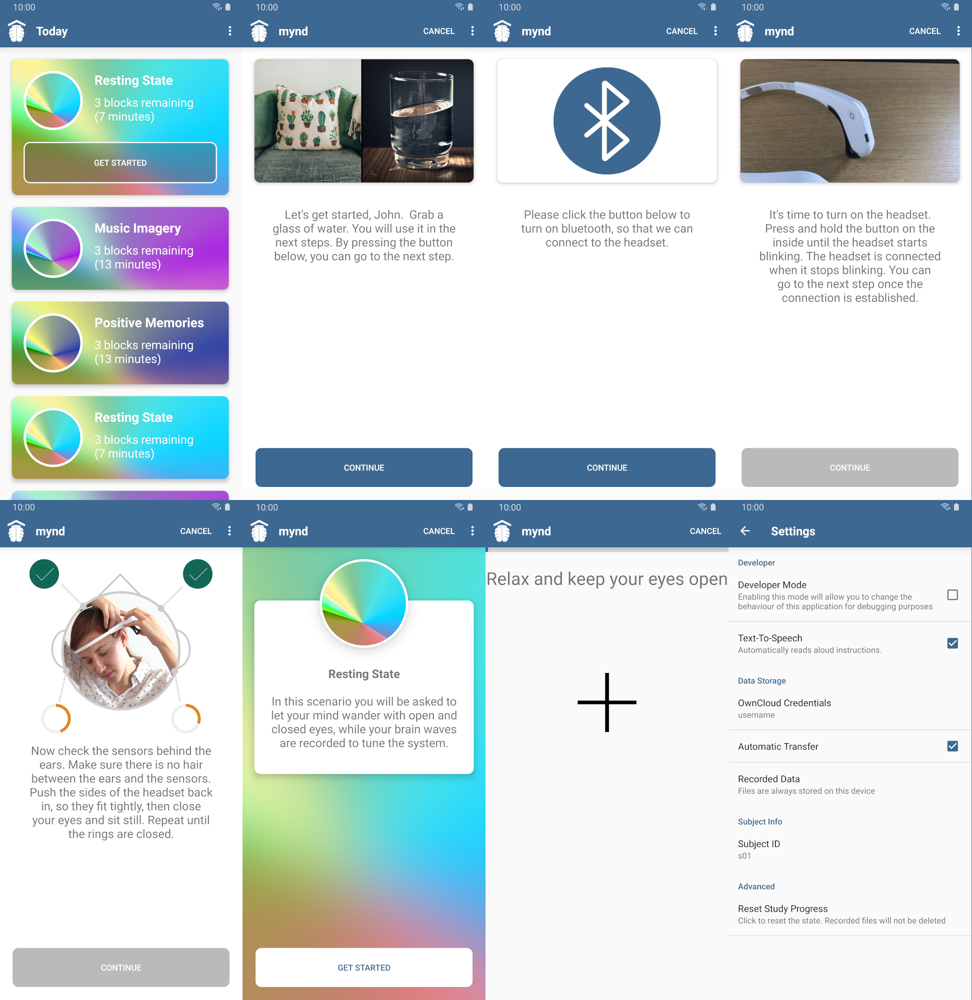

# Mynd

This is the Android version of Mynd.

## Motivation for Mynd
We aim for people to perform EEG experiments without any assistance of an experimenter.
Participants must be given instructions on how to perform the experiment, i.e.,
how to use the headband and how to behave during recording. In a nutshell,
the app needs to accomplish all tasks usually done by an experimenter.

## Features: For Subjects
MYND provides a user-interface that lets subjects:
- establish a connection with a consumer-grade EEG (currently the Muse EEG headband)
- fit the headset by using a real-time feedback algorithm on signal quality
- record neurophysiological data in self-paced studies
- transfer the data to a server

No internet connection required: data processing, storage, and experiment progression are managed on-device

## Features: For Scientists and Developers
Scientists and developers can easily extend the MYND application and use it to run large-scale studies.
- The flexible language Kotlin allows for concise and clean code
- bluetooth connection to the headband is managed by the libmuse library -- no need to comprehend underlying protocol.
- multi language support is easily extendable to further languages 

## Setup

Mynd can connect to a WebDav Server for storing experimental data.
You can configure the server's base url and root path in
`app/src/main/res/values/stringconstants.xml`.
Just change `owncloud_baseURL` and `owncloud_path` to point to a WebDav server.
Data Encryption is not part of this app, but it can easily be integrated (as described [here](https://developer.android.com/guide/topics/security/cryptography)
You may also change `signup_password` (default: 'start'), the password required when starting the application.

###SharedPrefs
Mynd keeps track of some data like the study state and the user name on the device in 
SharedPreferences, whenever the app is not in use. In the `SharedPrefsController`, you can change the version name of the app, in case
breaking changes to the storage model are introduced.

## Build

### Libraries
The app is developed in Kotlin 1.2.4 for Android SDK Version 27 (Android 8.1 Oreo).
Gradle 4.4 is used as a build tool with the Android Gradle Plugin Version 3.1.4.

Android Studio 3.1.4 was used for development. The app was used with a Samsung Galaxy S7 and a Samsung Galaxy S9.

The third party libraries `sardine` and `disposebag` need to be added as directories in the root folder. They are specified
to be included in the gradle build script. They were included from this repository, but can easily be retrieved from the sources specified in the subsequent section.

#### Android-DisposeBag
https://github.com/kizitonwose/android-disposebag

License: MIT License

#### Sardine
https://github.com/thegrizzlylabs/sardine-android

Apache License 2.0

#### Muse SDK
The directory `app/libs` needs to include two items:
* the `libmuse_android.jar` library for the Interaxon Muse headband.
* the directory `armeabi-v7a` containing the native code library `libmuse_android.so`
For the native library to work on certain devices, it may also be required to include 
the the directory `armeabi-v7a` or library `libmuse_android.so`
into  `Android/app/src/main/jniLibs/`.
To build libmuse with gradle, please include the jar in the `libmuse_android` directory.

The license of the Muse SDK does not allow shipping the library with this software. If needed,
please request the library on the [Interaxon Website](https://choosemuse.com/development/).

Remark: This app has been developed in Q2/Q3 2018. The latest version of Android Studio comes
pre-bundled with a later version of the Kotlin language and refuses build with an older version.
You may consider building with AndroidStudio 3.1.4.

#### GifImageView
https://github.com/felipecsl/GifImageView/

License: MIT License

#### Blur View
https://github.com/Dimezis/BlurView
License: Apache License 2.0

#### Material Dialogs
https://github.com/afollestad/material-dialogs

License: Apache License 2.0

#### Circular Progress Bar
https://github.com/lopspower/CircularProgressBar

License: Apache License 2.0

#### Circular Image View (hdodenhof)
https://github.com/hdodenhof/CircleImageView

License: Apache License 2.0

#### Circular Image View (jackandphantom) 
Apache License 2.0

#### RxAndroid
https://github.com/ReactiveX/RxAndroid

License: Apache License 2.0

#### SpeakerBox
https://github.com/mapzen/speakerbox

License: Apache License 2.0

## App Interface

### Welcome Screen (Home Activity) 

After starting the app and logging in with a name and ID (default password: 'start'), the user is presented with a list of tasks to be completed.
In the experiments conducted for Mynd, the tasks are a specific sequence of experiment blocks. In future use cases, this list
may show patients’ tasks on a daily basis. The welcome screen gives users an
overview of their progress within the study. 

The scenarios that should be conducted are defined in
`app/src/main/java/com/bwirth/myndandroid/model/Study.kt`.

The task list gets shorter as the user
completes tasks. The tasks are in a fixed order, and only the uppermost task can be
started from within the welcome screen, as can be seen in image 1 

A tap on the respective button will help the user setting up the connection with the headband,
before starting the actual experiment.

### Headband Setup
There are some necessary steps to put on the headband and connect it to the smart-
phone. The app is designed to help users complete all steps in an easy and un-
derstandable way. The app connects to the headband via Bluetooth. That requires
permissions to be granted by the user and turning on the device among some fur-
ther actions. To maintain good usability, the necessary actions are presented in
a short video clip. Additionally, the instructions can be read below. However, since patients may not be able to read the instructions, they
will also be read aloud by a text-to-speech engine. The verbal instructions may be
repeated at any time by tapping on the screen. To make the interface as simple as
possible, there is only a single button on the bottom, leading to the next instruc-
tion. Some steps cannot be skipped until the app confirms they are completed. For
example, in the instruction step shown above, the button in the bottom will
not be enabled until the app receives a signal from the headband indicating that it

### Fitting Procedure
EEG experiments require good contact between the electrodes and the skin. Usu-
ally, an experimenter would undertake the fitting procedure of the electrodes. Since
the experiments to be done with Mynd are conducted without an experimenter, the app includes
a step to verify that the headband fits well. This is a crucial step as the fit strongly 
influences the data quality. EEG electrodes with bad contact lead to increased noise in
the signal. 

Accordingly, we assume the variance in the EEG data to be an indicator
of fitting quality. The app analyzes the EEG data online and measures the variance
in the data. Users are presented circular progress bars and are instructed to fill
them up by adjusting the headband in the location of the concerning electrode. The algorithm for mapping the variance of the EEG channels to a fitting
percentage, uses a variance threshold of 150μV^2. To ensure continuously 
sustained data quality, the headband’s fit is determined after each block of trials.
Participants need to refit the headband only if the variance increases above
the threshold. Otherwise, they can directly start the next block.

### Experiment Procedure
During the actual recording phase, it is crucial that participants follow the in-
structions. Therefore, the screen provides a brief introduction,
allowing participants to prepare for the trials.

During the experiment, the participants are instructed by both written text on the
screen as well as the same text read aloud. The app gives users
an idea about how long it will take to complete
certain steps. In the aforementioned welcome screen, there is a duration estimate
for every block. During each block, a small progress bar on the top
of the screen illustrates the remaining time of the current block.

### Data Storage
After each block, the app will automatically upload the newly acquired data
to a web server via WebDAV, but only if Wi-Fi is available. All data will also
be stored on the device itself, such that a stable internet connection is not
required. If data cannot be uploaded, the app will keep track of that and
automatically initiate an upload at a later time. There is also a settings menu
exclusive to experimenters in which the raw data can be managed (allows
viewing, uploading and deleting data). The immediate upload to a server
allows the experimenter to access the data as the participant advances with
the study.

### Settings

From the home screen of the app, you can press the overflow menu to get into the settings activity.
Settings are not supposed to be changed by people conducting experiments. The activity is therefore
protected with a password (default: `admin`). You may change this password in
`app/src/main/res/values/stringconstants.xml`. 

### Data Integrity
The app is used to conduct scientific experiments. Therefore, it is critical to
keep track of the study progress, as well as keeping environmental influences
at a minimum. The app will detect whenever the app is closed during an
experiment or when the device is disconnected. If the app is closed during
any trial, but the headband is still connected, then the app offers to restart
the current block from the beginning. In any other case of interruption, the
user is guided back to the main menu, with the current block retained as the
next task to be completed. Only fully completed blocks are uploaded to the
server. When an interruption occurs, this will be visible to the experimenter
via logs on the server, but no EEG data will be saved for such blocks.

### Multi-Language Support
The app has built-in multi-language support, facilitating studies with patients of
various mother tongues. Currently, English and German language are available.

## Conducting Experiments

The structure of an experiment has the following hierarchy:

* Study
    * Scenario
        * Block
            * Trial

For example, the existing study contains the following scenarios:
* Study
    * Resting State
        * block1 (trial order shuffled randomly)
            * Eyes-Open-Trial
            * Eyes-Closed-Trial
        * block2 (trial order shuffled randomly)
            * Eyes-Open-Trial
            * Eyes-Closed-Trial
        * block3 (trial order shuffled randomly)
            * Eyes-Open-Trial
            * Eyes-Closed-Trial
    * Music
        * block1 (trial order shuffled randomly)
            * Music-Trial
            * Mental-Subtraction-Trial
            * Music-Trial
            * Mental-Subtraction-Trial
            * Music-Trial
            * Mental-Subtraction-Trial
         * block2 (trial order shuffled randomly)
            * Music-Trial
            * Mental-Subtraction-Trial
            * Music-Trial
            * Mental-Subtraction-Trial
            * Music-Trial
            * Mental-Subtraction-Trial
         * block3 (trial order shuffled randomly)
            * Music-Trial
            * Mental-Subtraction-Trial
            * Music-Trial
            * Mental-Subtraction-Trial
            * Music-Trial
            * Mental-Subtraction-Trial
    * Memories
        * ...similar to above 
    * Resting State
        * ...similar to above
    * Music
        * ...similar to above 
    * Memories
        *  ...similar to above

Trials in blocks can be shuffled, and balanced groups can be created within the app.
For Mynd, we assigned subject IDs to participants. Based on the id, we made the app generate
a different order of scenarios to match the balanced groups definied in the code beforehand.

#### Attribution
Coffee Icon:
https://pixabay.com/illustrations/coffee-break-icon-symbol-cup-4103050/
