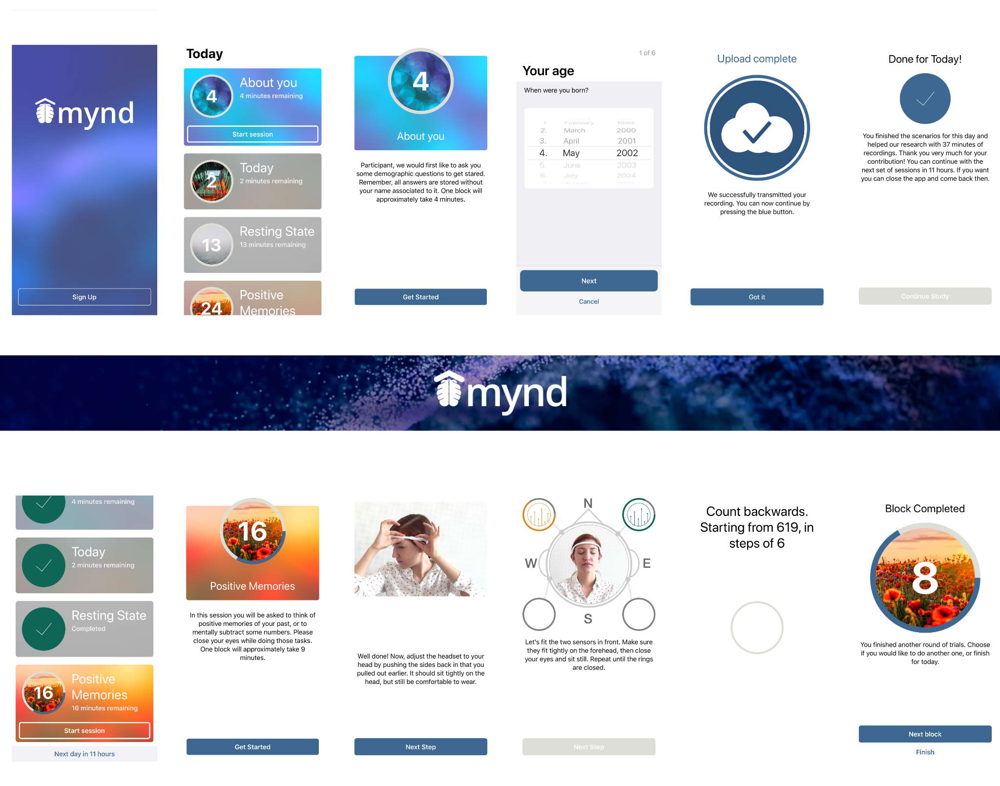

# MYND: Neuroscience at Home
MYND is a framework that allows for easy, self-supervised, at-home participation in large-scale, multi-day neurophysiological recordings. It was originally designed to help with the unsupervised evaluation of control strategies for brain-computer interfaces under realistic conditions.

## Motivation
Using thoughts to interact with our surroundings through brain-computer interfaces (BCIs) could be the next frontier of personal and medical technology. However, research in this area is still stuck with laboratory equipment in controlled environments. This makes it hard to translate conceptual systems into the realistic context in which they ultimately need to function. MYND was developed to tackle this limitation. The goal of this platform is to provide a tool that lets subjects easily evaluate conceptual BCIs and participate in large-scale neurophysiological studies at home, without expert supervision. See reference (1) for more details.

## Features: For Subjects
MYND provides a user-interface that lets subjects:
- establish a connection with a consumer-grade EEG (currently the Muse EEG headband)
- fit the headset by using a real-time feedback algorithm on signal quality
- record questionnaire or neurophysiological data in multi-day studies, with a flexible timeout mechanism
- transfer the data to a server with asymmetric encryption

No internet connection required: data processing, storage, and experiment progression are managed on-device

## Features: For Scientists and Developers
Scientists and developers can easily extend the MYND application and use it to run large-scale studies:
- Abstracted signal processing through observer-patterns RxSwift: Specific hardware classes can be implemented without changing the processing pipeline. A generic oscillator function can be used to test the application without connecting hardware.
- Data storage in widely-used HDF5 and JSON formats, example files and a MATLAB load function can be found in `supplements`.
- Questionnaire sessions and steps for hardware preparation are defined in localized JSON files: Quick creation of multiple choice questionnaires and adaption to experimental needs and languages.

Some pointers for features that you may likely want to adapt were collected in the [documentation](./docs/index.md)

## Getting started
Please read the [documentation](./docs/index.md) once in it entirety before you use this application, to get an overview over the provided functionality, and possible starting points to adapt the application to your needs.

1. Check out this repo and use cocoapods to install dependencies. Make sure to review the [CREDITS](./CREDITS.md) for third-party licenses.
3. If you would like to use the app with the Muse 2016 EEG headband, get in touch with InteraXon at https://choosemuse.com/development/
4. Use `Setup.swift` to configure basic parameters for your needs, server addresses etc. 
5. Provide your own consent, questionnaires, subject information, and __encryption key__ by using the available templates
5. Compile and deploy! MYND was developed for iOS 12 with Swift 4.2.

## Cite this framework:
*tbd*, e.g. Matthias R. Hohmann, Brian Wirth, Michelle Hackl, Talha Zaman, Raffi Enficiaud, Moritz Grosse-Wentrup, and Bernhard Schölkopf. (2020). MYND: Neuroscience at Home. Zenodo. http://doi.org/XX.XXX/zenodo.XXXXXXX

## Scientific Publications using MYND:
1. Hohmann, M. R., Konieczny, L., Hackl, M., Wirth, B., Zaman, T., Enficiaud, R., Grosse-Wentrup, M., & Schölkopf, B. (2020). MYND: Unsupervised Evaluation of Novel BCI Control Strategies on Consumer Hardware. http://arxiv.org/abs/2002.11754

2. Hohmann, M. R., Hackl, M., Wirth, B., Zaman, T., Enficiaud, R., Grosse-Wentrup, M., & Schölkopf, B. (2019). MYND: A Platform for Large-scale Neuroscientific Studies. In Extended Abstracts of the 2019 CHI Conference on Human Factors in Computing Systems (pp. 1–6). ACM Press. https://doi.org/10.1145/3290607.3313002

3. Hohmann, M., Hackl, M., Wirth, B., Zaman, T., Enficiaud, R., Grosse-Wentrup, M., & Schölkopf, B. (2019). Forschung mit allen: Eine Smartphone App zur Teilnahme an neurowissenschaftlicher Grundlagenforschung in ALS. Nervenheilkunde, 38(05), P22. https://doi.org/10.1055/s-0039-1685040

## Credits
Check the [CREDITS](./CREDITS.md) for more information on used media, third-party licenses, and contributors.

## License
Check [LICENSE](./LICENSE.md) for licensing information of this application.